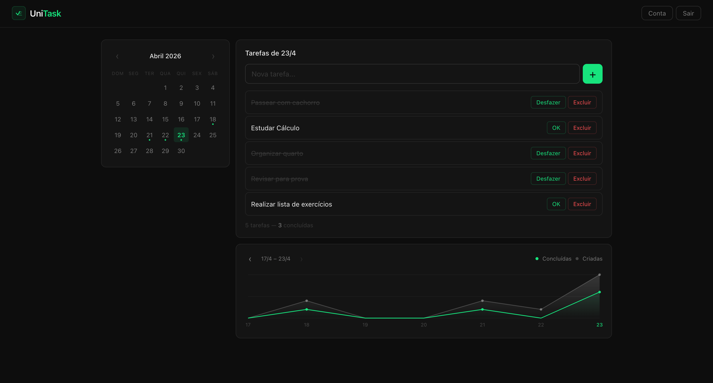
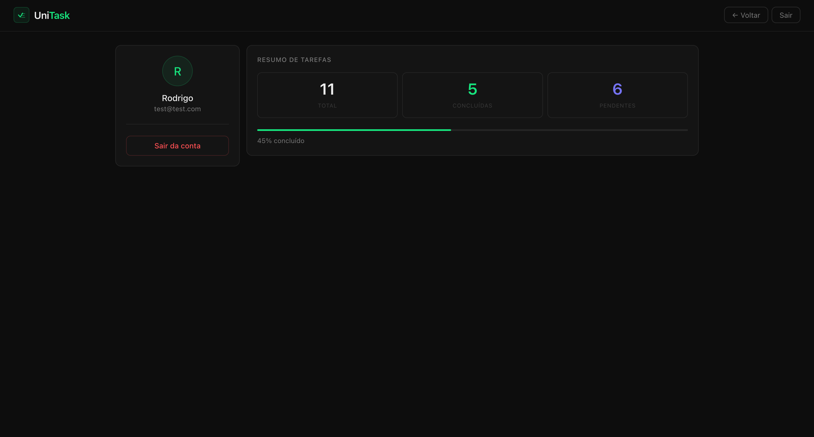
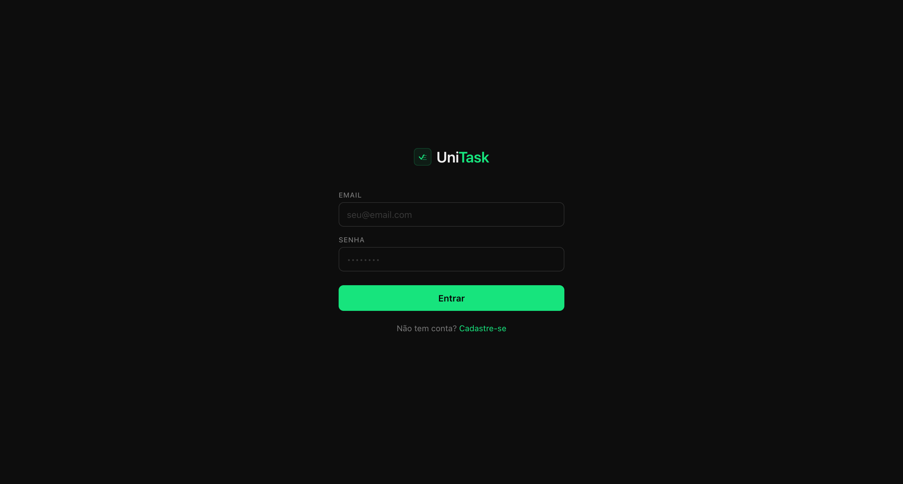

# ✅UniTask

> [Português](#português) | [English](#english)


## Português

**UniTask** é um gerenciador de tarefas full-stack com calendário, gráfico de atividade navegável e autenticação real com JWT. Cada tarefa fica salva no banco (Supabase)

### Preview






### Funcionalidades

- Cadastro e login com JWT + bcrypt
- Tarefas vinculadas a datas, filtradas por dia ao clicar no calendário
- Pontos no calendário mostram em quais dias do mês você tem tarefas
- Gráfico de linha navegável dos últimos 7 dias (ou qualquer semana anterior)
- Gráfico desenhado com a Canvas API nativa
- Layout responsivo
- Página de conta com resumo de tarefas e barra de progresso

### Tecnologias


### Como rodar

**1 Clone e instale**

```bash
git clone https://github.com/RodrigoDutraF88/unitask.git
cd unitask
npm install
```

**2 Configure as variáveis de ambiente**

Crie um arquivo `.env` na raiz do projeto:

```
SUPABASE_URL=sua_url_aqui
SUPABASE_KEY=sua_chave_aqui
JWT_SECRET=qualquer_string_secreta
PORT=3000
```

**3 Crie as tabelas no Supabase**

No painel do Supabase, vá em SQL Editor e rode:

```sql
create table users (
  id uuid primary key default gen_random_uuid(),
  nome text not null,
  email text unique not null,
  senha text not null,
  created_at timestamptz default now()
);

create table tasks (
  id uuid primary key default gen_random_uuid(),
  user_id uuid references users(id) on delete cascade,
  titulo text not null,
  date date,
  completed boolean default false,
  created_at timestamptz default now()
);
```

**4 Suba o servidor**

```bash
npm run dev
```

Abra `frontend/pages/login.html` no navegador ou sirva a pasta `frontend/` com qualquer servidor estático

### Estrutura

```
unitask/
├── src/
│   ├── config/
│   │   └── supabase.js
│   ├── controllers/
│   │   ├── auth.controller.js
│   │   └── tasks.controller.js
│   ├── routes/
│   │   ├── auth.routes.js
│   │   └── tasks.routes.js
│   └── middlewares/
│       └── auth.middlewares.js
├── frontend/
│   ├── js/
│   │   ├── api.js
│   │   ├── home.js
│   │   ├── login.js
│   │   └── account.js
│   ├── css/
│   │   └── style.css
│   └── pages/
│       ├── home.html
│       ├── login.html
│       └── account.html
├── server.js
├── .env.example
└── package.json
```

### API

| Método | Rota | Auth | Descrição |
| --- | --- | --- | --- |
| POST | `/auth/register` | — | Criar conta |
| POST | `/auth/login` | — | Login, retorna JWT |
| GET | `/tasks` | ✓ | Listar tarefas (`?date=` ou `?from=&to=`) |
| POST | `/tasks` | ✓ | Criar tarefa |
| PATCH | `/tasks/:id` | ✓ | Marcar como concluída |
| DELETE | `/tasks/:id` | ✓ | Deletar tarefa |

### O que aprendi

Este foi um dos primeiros projetos full-stack completos, desenvolvido por mim e meu colega, com frontend, backend e banco de dados totalmente integrados e dados reais persistindo entre sessões e dispositivos.

Na prática, implementamos autenticação baseada em JWT com validação no servidor usando Express, garantindo que todas as requisições fossem autenticadas antes de acessar o banco. Também trabalhamos com Supabase pela primeira vez, aplicando boas práticas de segurança com bcrypt para hashing de senhas e entendendo na prática por que credenciais nunca devem ser armazenadas em texto puro.

No frontend, desenvolvemos um gráfico de linha utilizando a Canvas API sem bibliotecas externas, além de trabalhar com módulos JavaScript nativos, compreendendo melhor escopo, carregamento de código e organização da aplicação.

Sem dúvida um dos maiores desafios foi buscar aprender novos conceitos, o que quase nos fez abandonar o projeto. Foi muito satisfatório ver uma ideia de praticar programação nas férias sair do papel e virar algo que pode ajudar nós, estudantes a organizar melhor nossas tarefas. Foi uma ótima lição de aprendizagem e trabalho em equipe.

## English

**UniTask** is a full-stack task manager with a calendar view, navigable activity chart, and real JWT authentication. Every task lives in the database (Supabase)

### Features

- Register and login with JWT + bcrypt
- Tasks tied to dates, filtered by day when you click the calendar
- Calendar dots show which days of the month have tasks
- Navigable line chart for any 7-day window in the past
- Chart drawn with the native Canvas API
- Responsive layout
- Account page with task summary and progress bar

### Getting Started

**1 Clone and install**

```bash
git clone https://github.com/RodrigoDutraF88/unitask.git
cd unitask
npm install
```

**2 Set up environment variables**

Create a `.env` file at the root:

```
SUPABASE_URL=your_url_here
SUPABASE_KEY=your_key_here
JWT_SECRET=any_secret_string
PORT=3000
```

**3 Create tables in Supabase**

In the Supabase dashboard, go to SQL Editor and run:

```sql
create table users (
  id uuid primary key default gen_random_uuid(),
  nome text not null,
  email text unique not null,
  senha text not null,
  created_at timestamptz default now()
);

create table tasks (
  id uuid primary key default gen_random_uuid(),
  user_id uuid references users(id) on delete cascade,
  titulo text not null,
  date date,
  completed boolean default false,
  created_at timestamptz default now()
);
```

**4 Start the server**

```bash
npm run dev
```

Open `frontend/pages/login.html` in your browser, or serve the `frontend/` folder with any static server.

### Project Structure

```
unitask/
├── src/
│   ├── config/
│   │   └── supabase.js
│   ├── controllers/
│   │   ├── auth.controller.js
│   │   └── tasks.controller.js
│   ├── routes/
│   │   ├── auth.routes.js
│   │   └── tasks.routes.js
│   └── middlewares/
│       └── auth.middlewares.js
├── frontend/
│   ├── js/
│   │   ├── api.js
│   │   ├── home.js
│   │   ├── login.js
│   │   └── account.js
│   ├── css/
│   │   └── style.css
│   └── pages/
│       ├── home.html
│       ├── login.html
│       └── account.html
├── server.js
├── .env.example
└── package.json
```

### API

| Method | Route | Auth | Description |
| --- | --- | --- | --- |
| POST | `/auth/register` | — | Create account |
| POST | `/auth/login` | — | Login, returns JWT |
| GET | `/tasks` | ✓ | List tasks (`?date=` or `?from=&to=`) |
| POST | `/tasks` | ✓ | Create task |
| PATCH | `/tasks/:id` | ✓ | Toggle completed |
| DELETE | `/tasks/:id` | ✓ | Delete task |

### What I Learned

This was one of the first complete full-stack projects, developed by me and my colleague, with frontend, backend, and database fully integrated and real data persisting between sessions and devices.

In practice, we implemented JWT-based authentication with server-side validation using Express, ensuring that all requests were authenticated before accessing the database. We also worked with Supabase for the first time, applying security best practices with bcrypt for password hashing and understanding in practice why credentials should never be stored in plain text.

On the frontend, we developed a line chart using the Canvas API without external libraries, in addition to working with native JavaScript modules, better understanding scope, code loading, and application organization.

Without a doubt, one of the biggest challenges was seeking to learn new concepts, which almost made us abandon the project. It was very satisfying to see an idea of practicing programming during the holidays come off the paper and become something that can help us students to better organize our tasks. It was a great lesson in learning and teamwork.

### License

MIT —> feel free to use, modify, and distribute

Feito por/Made by [RodrigoDutraF88](https://github.com/RodrigoDutraF88) & [cauamc2006-sketch](https://github.com/cauamc2006-sketch)
